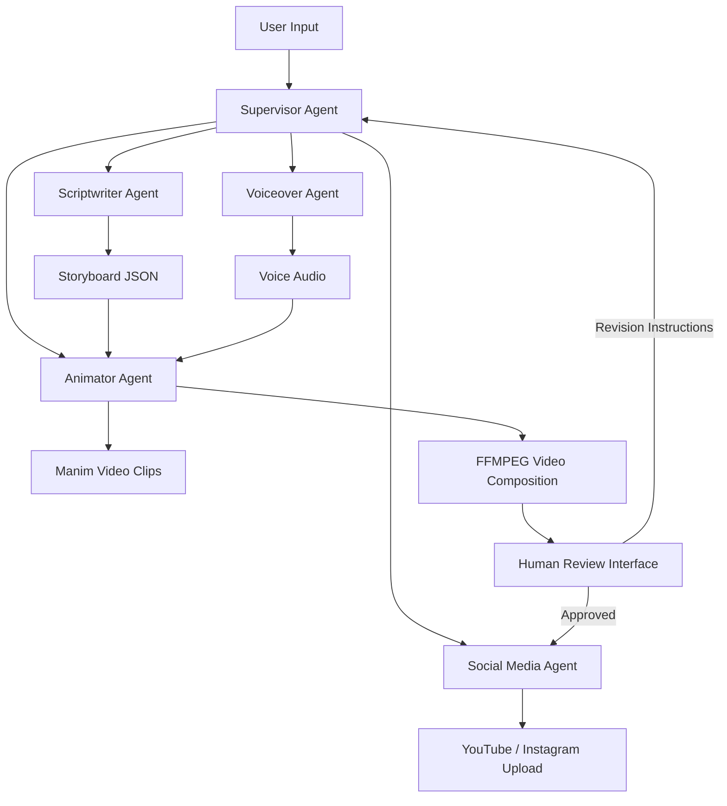
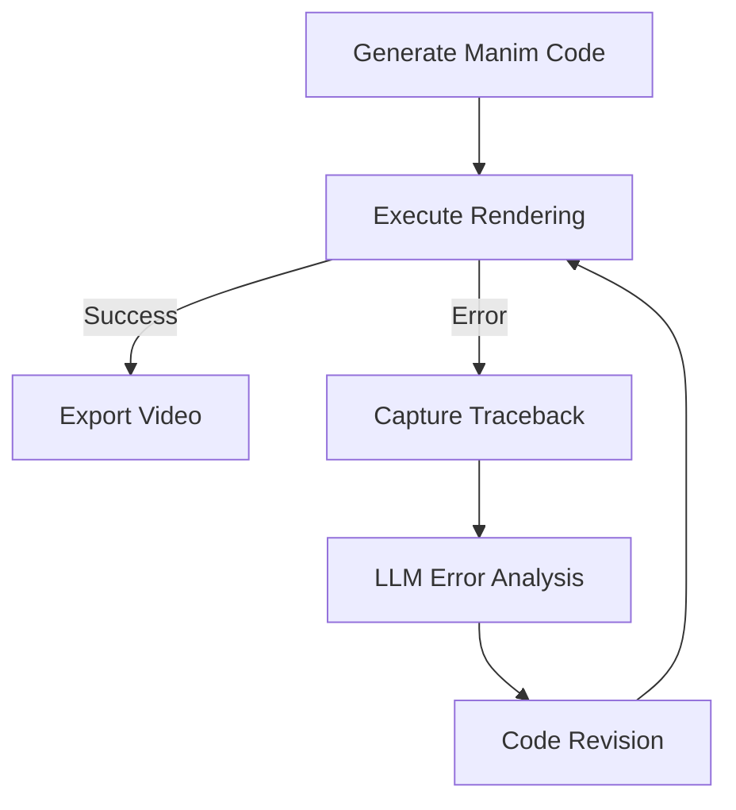
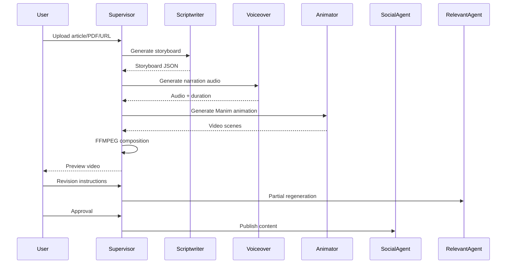

# Project Proposal
## AI-Powered End-to-End Automated Science Animation Generation System

---

# 1. Project Overview

## 1.1 Project Title
**AI-Powered End-to-End Automated Science Animation Generation System**

## 1.2 Project Summary

This project aims to develop a fully automated End-to-End science animation generation pipeline powered by Multi-Agent AI collaboration. Users only need to provide:

- A science article
- PDF lecture notes
- Or an article URL

The system will automatically generate:

- Educational storyboard scripts
- Manim animation code
- Voice narration
- Social media content
- Final rendered video

The platform integrates Human-in-the-Loop (HITL) mechanisms, enabling users to review and iteratively modify generated content using natural language instructions before publication.

The ultimate goal is to significantly reduce the production cost and technical barrier of high-quality educational animations while maintaining professional output quality.

---

# 2. Background and Motivation

## 2.1 Problem Statement

High-quality educational animations such as those created by 3Blue1Brown greatly enhance learning effectiveness. However, producing such content traditionally requires:

- Professional scripting skills
- Animation programming expertise
- Voiceover production
- Video editing
- Significant time investment

For independent educators and content creators, the production workflow is highly time-consuming and technically demanding.

---

## 2.2 Motivation

This project is motivated by three primary objectives:

### (1) Lowering Educational Content Production Barriers
Enable educators without animation expertise to generate professional science videos automatically.

### (2) Exploring Multi-Agent AI Collaboration
Validate the feasibility and effectiveness of Multi-Agent systems in complex multimedia generation tasks.

### (3) Advancing Generative AI Applications
Demonstrate practical integration of Generative AI into real-world educational technology workflows.

---

# 3. Project Objectives

The system aims to achieve the following objectives:

- Automatically transform science articles into educational videos
- Generate synchronized narration and animations
- Support iterative Human-in-the-Loop refinement
- Automate social media content generation and publishing
- Reduce production time from days to minutes
- Provide a scalable educational content generation platform

---

# 4. System Architecture

## 4.1 Overall Architecture

The system is coordinated by a central **Supervisor Agent** responsible for orchestrating task flow between specialized AI agents.



---

# 5. Multi-Agent System Design

## 5.1 Supervisor Agent

### Responsibilities
- Workflow orchestration
- State management
- Agent communication
- Error handling
- Task scheduling

### Technologies
- LangGraph
- LangChain
- State Machine Architecture

---

## 5.2 Scriptwriter Agent

### Responsibilities
- Extract key educational concepts
- Convert source material into storytelling format
- Generate structured storyboard scripts

### Output Format

```json
{
  "scene_id": 1,
  "narration": "Explanation text",
  "visual_description": "Animation description",
  "estimated_duration": 12
}
```

### Features
- Educational storytelling optimization
- Scene segmentation
- Timing estimation
- Visual instruction generation

---

## 5.3 Animator Agent (Core Technical Component)

### Responsibilities
- Generate Python Manim code
- Execute rendering process
- Handle animation synchronization
- Self-correct rendering errors

### Core Technologies
- Python
- Manim Community Edition
- Docker Sandbox
- FFMPEG

### Self-Correction Workflow



### Key Innovation
The Animator Agent implements an automated debugging loop capable of:

- Reading traceback logs
- Diagnosing rendering issues
- Revising Manim code
- Re-rendering automatically

This significantly improves system reliability.

---

## 5.4 Voiceover Agent

### Responsibilities
- Convert narration into speech
- Calculate precise audio duration
- Return synchronization metadata

### Technologies
- OpenAI TTS
- ElevenLabs API

### Synchronization Mechanism

The generated audio duration serves as the ground truth for animation timing.

Example:

```python
animation.run_time = audio_duration
```

This ensures accurate synchronization between animation and narration.

---

## 5.5 Social Media Manager Agent

### Responsibilities
- Generate social media descriptions
- Create hashtags
- Generate video titles
- Upload videos automatically

### Supported Platforms
- YouTube
- Instagram
- TikTok (future extension)

### APIs
- YouTube Data API v3
- Instagram Graph API

---

# 6. Human-in-the-Loop (HITL) Design

## 6.1 Purpose

Although LLMs can generate high-quality outputs, fully autonomous systems may still produce:

- Incorrect animations
- Poor pacing
- Inaccurate visual representations

Therefore, Human-in-the-Loop mechanisms are introduced to ensure quality control.

---

## 6.2 Workflow

### Step 1: Initial Generation
The system automatically generates:
- Storyboard
- Narration
- Animation draft
- Final preview video

### Step 2: Human Review
Users review the generated video through:
- Streamlit interface
- Gradio interface

### Step 3: Natural Language Revision
Users can provide revision instructions such as:

> “Change the circle in Scene 2 to red and slow down the narration.”

### Step 4: Localized Regeneration
The system routes revision instructions to the appropriate Agent and regenerates only affected segments.

---

# 7. Technical Challenges and Solutions

| Challenge | Description | Proposed Solution |
|---|---|---|
| Manim Code Hallucination | LLM generates invalid functions or syntax | RAG-based Manim documentation retrieval + self-correction loop |
| Audio-Video Synchronization | Mismatch between narration and animation timing | Use TTS duration as timing ground truth |
| Multi-Agent State Management | Data inconsistency across agents | LangGraph state machine architecture |
| Rendering Failures | Runtime rendering crashes | Docker sandbox + traceback repair |
| Long Video Generation Time | Rendering can be computationally expensive | Parallel rendering + scene segmentation |

---

# 8. Technology Stack

## Backend
- Python
- FastAPI

## AI Frameworks
- LangChain
- LangGraph
- AutoGen

## LLM Models
- GPT-4o
- Claude 3.5 Sonnet

## Animation & Media
- Manim Community Edition
- FFMPEG

## Speech Synthesis
- ElevenLabs API
- OpenAI TTS

## Frontend
- Streamlit
- Gradio

## Deployment
- Docker
- Linux Server
- GPU Acceleration

---

# 9. System Workflow



---

# 10. Development Timeline

| Phase | Duration | Tasks |
|---|---|---|
| Phase 1 | Weeks 1-2 | Research and architecture design |
| Phase 2 | Weeks 3-5 | Multi-Agent framework implementation |
| Phase 3 | Weeks 6-8 | Manim generation and rendering |
| Phase 4 | Weeks 9-10 | Voice synchronization |
| Phase 5 | Weeks 11-12 | HITL interface development |
| Phase 6 | Weeks 13-14 | Social media automation |
| Phase 7 | Weeks 15-16 | Testing and optimization |

---

# 11. Expected Outcomes

## Functional Outcomes
- Fully automated educational video generation pipeline
- Multi-Agent collaborative AI system
- Human-review interactive interface
- Automated social media publishing

---

## Performance Goals

The system should be capable of:

- Processing 500+ word science articles
- Generating 1–2 minute educational videos
- Completing generation within practical time constraints
- Maintaining synchronization accuracy
- Reducing production time significantly

---

# 12. Innovation and Research Value

## 12.1 Educational Technology Innovation
This project demonstrates how Generative AI can revolutionize educational content production.

---

## 12.2 Multi-Agent AI Research
The project serves as a practical implementation of:
- Multi-Agent coordination
- AI workflow orchestration
- Autonomous debugging systems

---

## 12.3 Human-AI Collaboration
The HITL mechanism explores effective collaboration between humans and AI systems in creative production workflows.

---

# 13. Future Extensions

Potential future developments include:

- Support for multiple languages
- AI-generated subtitles
- Real-time collaborative editing
- Personalized teaching styles
- Interactive educational videos
- Mobile application integration

---

# 14. Conclusion

This project proposes a comprehensive AI-powered educational animation generation system integrating:

- Multi-Agent collaboration
- Automated animation generation
- Voice synthesis
- Human-in-the-Loop refinement
- Social media automation

The system aims to dramatically reduce educational content production costs while maintaining high-quality outputs.

By combining advanced Generative AI technologies with practical educational applications, this project aligns strongly with the goals of innovation, interdisciplinary integration, and real-world AI deployment.

---

# 15. References

1. Manim Community Documentation
2. LangChain Official Documentation
3. LangGraph Documentation
4. OpenAI API Documentation
5. ElevenLabs API Documentation
6. YouTube Data API v3 Documentation
7. 3Blue1Brown Animation Methodology
